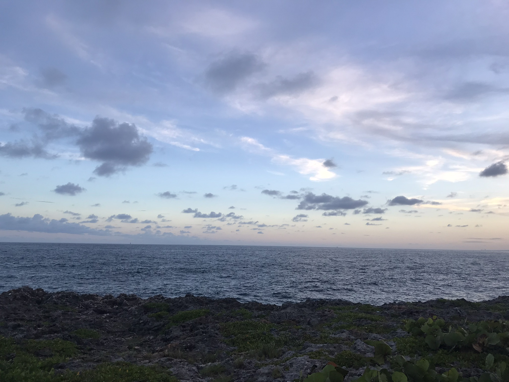

# 👋 Salam, I'm Leonardo Castillo

## 👤 About me

- 👨‍💻 I do full-stack development and mobile apps
- 🎥 I create content on computer science and self-improvement
- 🎯 I'm currently learning the Rust and low level programming
- 🧩 I enjoy solving problems and building systems from scratch

## 🧠 My Knowledge

- 📚 Data Structures & Algorithms
- ⚙️ Backend: REST APIs, databases, system design, GraphQL
- 🎨 Frontend: UI/UX, responsive design
- 📱 Mobile App Development: Flutter, Android emulators, platform-specific integrations
- 🧵 Concurrency and memory safety (currently learning via Rust)
- 🔐 Basic security practices and principles
- 🧠 Self-taught in multiple areas of computer science

## 🧰 My Stack
- 🧑‍💻 **Languages**: Rust, Go, JavaScript/TypeScript, C#, Bash
- 🧱 **Frameworks**: Flutter, Svelte, Node.js, Axum, Express, Fiber, Nest.js, Angular, ASP.NET Core
- 🛢️ **Databases**: PostgreSQL, Supabase, SQLite, MongoDB
- 🔧 **Tools**: Git, Neovim (LazyVim), Linux (Arch, Hyprland, i3wm), Android Studio, Docker
- 🌐 **Platforms**: Firebase, Supabase, Vercel, Netlify, Shuttle
- 📱 **Mobile Development**: Flutter (cross-platform)
- 💡 **Currently exploring**: Embedded systems, Game Dev with Bevy or Godot, SeaORM

## 📫 How to Reach Me
- 📧 Email: [leocm889@gmail.com]
- 📺 YouTube: [Leonardo](https://www.youtube.com/@leo_cm889)
- 💬 DMs open for collaboration, dev talk, or content ideas!
